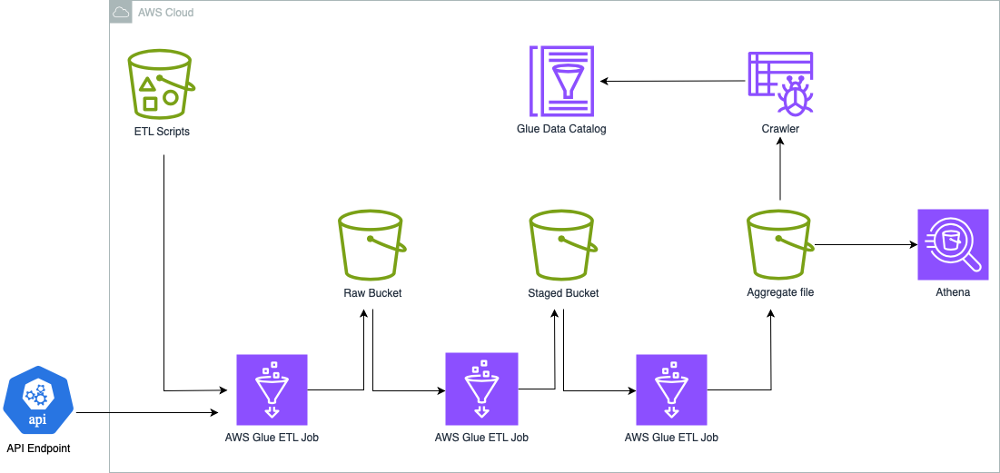
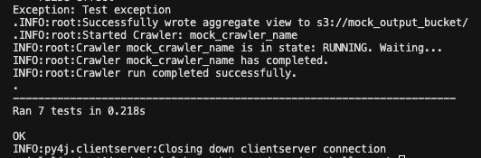

# ABinBev Data Engineering Challenge
## Overview
Este projeto de engenharia de dados envolve a extração de dados de uma API, a transformação desses dados e a sua visualização agregada. A solução é composta por uma stack cloudformation, que provisiona recursos AWS Glue, os scripts de ETL que rodam no ambiente serverless, versöes sem variáveis de ambiente para permitir testes unitários e os arquivos de testes.

### Data Architecture
#### Componentes da Arquitetura

1. **AWS Glue**:
   - **Função**: Orquestração e execução das tarefas de ETL.
   - **Vantagens**:
     - Integração Nativa com Outros Serviços AWS.
     - Facilita a gestão de agendamento e monitoramento de workflows complexos.
     - Possui uma interface web intuitiva para acompanhamento das execuções.

2. **Amazon S3**:
   - **Função**: Armazenamento intermediário dos dados extraídos da API e dos arquivos transformados.
   - **Vantagens**:
     - Armazenamento escalável e altamente disponível.
     - Integração fácil com outras ferramentas e serviços de dados.
     - Modelo de pagamento por uso, reduzindo custos operacionais.

3. **Athena**:
   - **Função**: Consulta interativa dos dados.
   - **Vantagens**:
     - Utiliza SQL padrão, facilitando o uso para analistas e cientistas de dados com conhecimentos em SQL.
     - Permite consultar dados diretamente no Amazon S3, sem necessidade de mover os dados.
     - Integração nativa com AWS Glue para gerenciamento de catálogos de dados e metadados.

#### Fluxo de Trabalho

1. **Extração de Dados da API para o S3**:
   - O primeiro job glue faz uma requisição a uma API, coleta os dados e os grava em um bucket S3. Este passo garante que os dados brutos sejam armazenados de forma durável e acessível.

2. **Transformação de Dados em Parquet**:
   - O segundo job lê os dados brutos do S3, transforma-os em um formato Parquet usando PySpark, e grava os arquivos Parquet novamente no S3. O formato Parquet é escolhido por sua eficiência de armazenamento e desempenho em consultas.

3. **Criação de Visualização Agregada**:
   - O terceiro script lê os arquivos Parquet do S3, realiza operações de agregação e transformação usando PySpark, e gera uma visualização agregada dos dados. Esta visualização pode ser armazenada novamente no S3 ou em outro sistema de armazenamento para posterior análise. Por último, o crawler é chamado para os dados estarem disponíveis para consulta via Athena. 

#### Considerações na implantação
Após subir a stack, é de suma importância que no console do Glue, ative os gatilhos, indo em Data Integration and ETL e acessando o item Triggers.
Na nuvem já há um bucket armazenando os scripts ETL, que são apontados na criação dos jobs na stack, como pode ser observado.

## Proposição em  Monitoramento e alerta
Pensando nas execuçöes e na visualização feitas pelo ambiente AWS Glue, os dados das execuçoes seriam coletados via cloudtrail, junto com os logs, armazenados em tópicos sns como eventos, gerados para tópicos SQS e por uma lambda, seriam colocados numa fila e armazenados em outro bucket pela lambda, dessa forma, falhas durante o processo seriam notificadas e haveria uma compreensão dos possíveis eventos de erro ao longo de todo o workflow. 

## Testes Unitários
Os testes unitários tem por objetivo testar as funçöes, ao todo, são 7 testes executados do módulo jobs, que contém as mesmas funçöes usadas nos jobs glue, porém com a diferença de que as funçoes foram isoladas para fins de teste, excluindo variáveis do ambiente glue, o que reduz a complexidade dos testes e permite focar no principal, para rodar os testes, certifique-se dos pré requisitos a seguir:

- Python 3.7 ou versão superior
- AWS CLI instalada e configurada com o arquivo .config
- Biblioteca unittest instalada
- Spark Instalado em seu ambiente

Para rodar os testes, execute o conando:
`python3 -m unittest discover -s tests`

você deve esperar esse output: 

## Considerações finais
Em caso de qualquer dúvida, não hesite em me contatar pelos links de email e linkedin que estão fixados no canto superior da minha página inicial. 