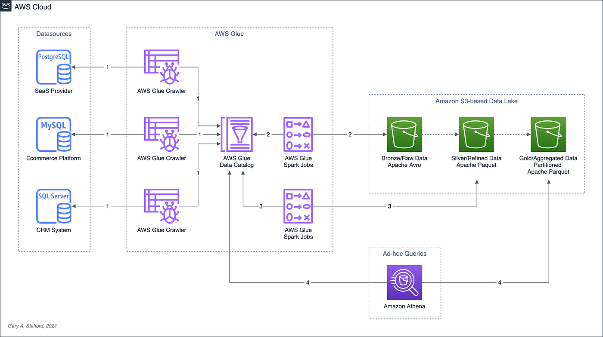

# ABinBev Data Engineering Challenge
## Overview
Este projeto de engenharia de dados envolve a extração de dados de uma API, a transformação desses dados e a sua visualização agregada. A solução é composta por uma DAG (Directed Acyclic Graph) do Apache Airflow, que coordena a execução de três scripts distintos. Todo o processo é executado dentro de um contêiner Docker, garantindo um ambiente consistente e isolado.

### Data Architecture
#### Componentes da Arquitetura

1. **Apache Airflow Gerenciado pela AWS**:
   - **Função**: Orquestração das tarefas de ETL.
   - **Vantagens**:
     - Permite a criação de DAGs que definem a ordem e as dependências das tarefas.
     - Facilita a gestão de agendamento e monitoramento de workflows complexos.
     - Possui uma interface web intuitiva para acompanhamento das execuções.

3. **Amazon S3**:
   - **Função**: Armazenamento intermediário dos dados extraídos da API e dos arquivos transformados.
   - **Vantagens**:
     - Armazenamento escalável e altamente disponível.
     - Integração fácil com outras ferramentas e serviços de dados.
     - Modelo de pagamento por uso, reduzindo custos operacionais.

4. **PySpark**:
   - **Função**: Transformação de dados e criação de visualizações agregadas.
   - **Vantagens**:
     - Capacidade de processamento de grandes volumes de dados de forma distribuída.
     - Suporte a operações avançadas de transformação e análise de dados.
     - Integração nativa com arquivos Parquet, permitindo consultas eficientes.

#### Fluxo de Trabalho

1. **Extração de Dados da API para o S3**:
   - O primeiro script da DAG do Airflow faz uma requisição a uma API, coleta os dados e os grava em um bucket S3. Este passo garante que os dados brutos sejam armazenados de forma durável e acessível.

2. **Transformação de Dados em Parquet**:
   - O segundo script lê os dados brutos do S3, transforma-os em um formato Parquet usando PySpark, e grava os arquivos Parquet novamente no S3. O formato Parquet é escolhido por sua eficiência de armazenamento e desempenho em consultas.

3. **Criação de Visualização Agregada**:
   - O terceiro script lê os arquivos Parquet do S3, realiza operações de agregação e transformação usando PySpark, e gera uma visualização agregada dos dados. Esta visualização pode ser armazenada novamente no S3 ou em outro sistema de armazenamento para posterior análise.

#### Vantagens da Solução

- **Escalabilidade**: A combinação de S3 e PySpark permite o processamento e armazenamento de grandes volumes de dados de maneira eficiente.
- **Modularidade**: Cada etapa do processo (extração, transformação e agregação) é gerenciada separadamente, facilitando a manutenção e a atualização de cada componente.
- **Reprodutibilidade**: O uso de Docker garante que o ambiente de execução seja consistente, eliminando problemas de compatibilidade entre ambientes de desenvolvimento e produção.
- **Orquestração Robusta**: Airflow oferece um controle granular sobre o fluxo de trabalho, incluindo a capacidade de reprocessar dados facilmente em caso de falhas.
- **Custo-eficiência**: S3 proporciona armazenamento econômico e o uso de PySpark em ambientes gerenciados pode ser ajustado conforme a necessidade, otimizando custos operacionais.

Essa arquitetura representa uma solução robusta e eficiente para projetos de ETL e transformação de dados, combinando o melhor das ferramentas de orquestração, armazenamento, processamento e contêineres.
## Proposição em  Monitoramento e alerta
Pensando nas execuçöes e na visualização feitas pelo ambiente gerenciado do apache airflow, os dados das execuçoes seriam coletados via cloudtrail, junto com os logs, armazenados em tópicos sns como eventos, gerados para tópicos SQS e por uma lambda, seriam colocados numa fila e armazenados em outro bucket pela lambda, dessa forma, falhas durante o processo seriam notificadas e haveria uma compreensão dos possíveis eventos de erro ao longo de todo o workflow. 